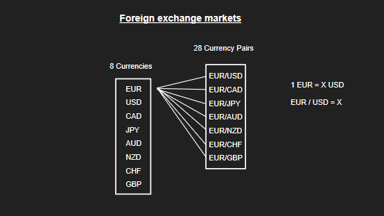
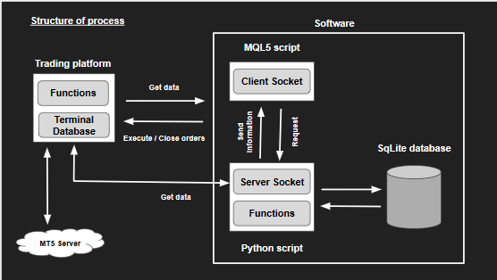

## 1.1 About Foreign Exchange Market

  Foreign Exchange Market also known as forex market is a kind of financial market it decentralized global market where all the world's currencies trade. It is one of the most actively traded markets in the world, with an average daily trading volume of $5 trillion. foreign exchange market, traded 24 hours a day, 5 days a week. In recent years, many of these different financial markets are open to the public. because of that there are many individual traders exist. 

  Mainly there are 10 developed floating currencies (G10) in the world. These 10 currencies contain more than 80 % of transection volume in the world. Those have high liquidity in the market. To this project I only consider this 8 only. 

    i.	EUR - Euro area currency
    ii.	USD - United States, Dollar
    iii.	JPY - Japanese Yen
    iv.	CAD - Canadian dollar
    v.	AUD - Australian Dollar
    vi.	NZD - New Zealand Dollar
    vii.	CHF – Switzerland franc
    viii.	GBP - The British Pound

  We can trade these one of currencies agents another currency. After combine 2 of these currencies we have 28 currency pairs.  So, there are 28*2 = 48 opportunities to trade. 

## 1.2 Structure of the process

This explains all the process of the system.

•	Trading Platform – To execute buy, sell orders need trading platform. There are many kinds of trading platforms are available in different brokers. 
Ex: - Use MT5 trading platform supplied by IC Markets broker

Trading platform comes with IDE called Metaediter 5. It supports mql5 programming language that similar to C++. It helps to create write mql5 scripts. trading platform only support mql5 scripts only (2019). Mql5 is still under developing language so it not suitable for complex data analysis. Trading platform get data from MT5 server.

•	Software – 
MQL5 script – this is the script running on trading platform. It contains client socket code. 
Python program – this is the part coding using python programming language. One of the python scripting function is server socket.
Those server socket and client socket is running on same local host (same PC). I use client server architecture for this to communicate between these 2 languages. The reason for this is trading platform not support python programming language (2019). 
Beside these server socket function there are many other functions like tester, generate report, etc written in python. 

•	SQLite database – stores the necessary data/ information.

